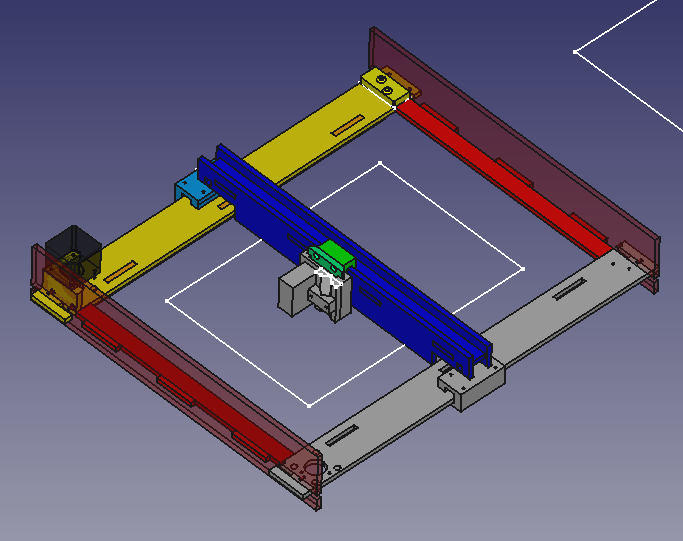
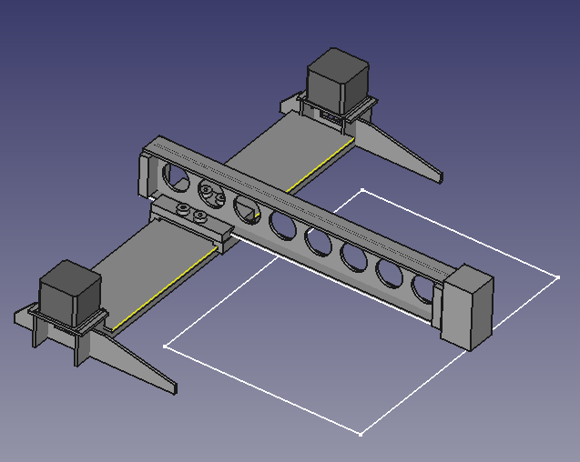
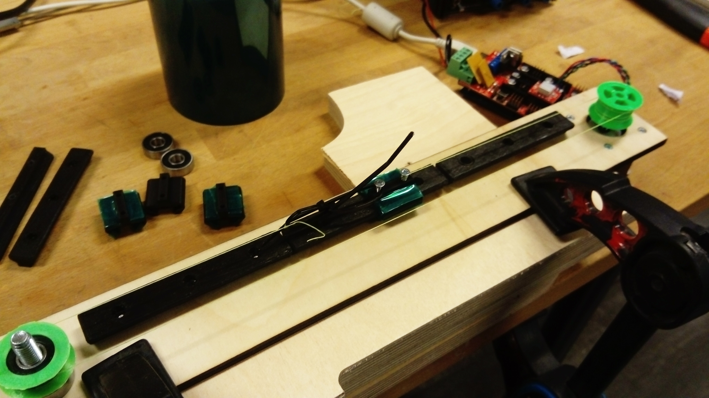
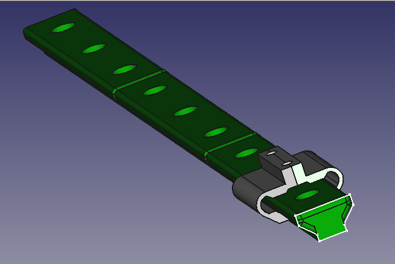
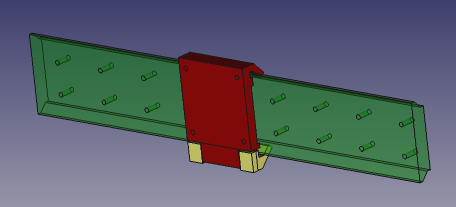
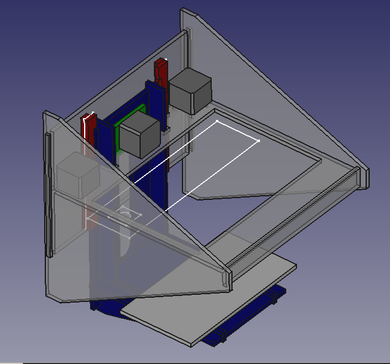

# TapeCore

Construction techniques for digital fabrication machines and linear axes that aim
to be extremely easy-to-replicate. Key ingredient is using tape surface for plain-bearings
on parts made with commonly available 3d-printers and/or laser-cutters.

# Handy

Open-bottom frame, meant to be positioned over workpiece/table.

## Handy A4

Small version, with A4 workarea (22 x 30 cm). 

[FreeCAD project](./handy-a4.fcstd)

[Bill-of-materials](https://docs.google.com/spreadsheets/d/1o2K1h2c_w2d49ZTSx7vD1f-7HGYju6wTmgCQS48S1lg/edit?usp=sharing)

### Status
April 2018: **Actively developed**

### TODO

v1.0 = penplotter

* Test plotting accuracy/speed
* Add endstops
* Improve Y axis backlash. Use rail on each side?
* Release lasercutting-ready files
* Document assembly steps

v1.1 = laserengraver

* Add holes for attaching to table/wall
* Improve diagonal stiffness. Wedge connecting rail with side?
* Test running plotter vertically
* Test with laserhead, primarily engraving
* Add laser guard around diode (Rishalaser style)
* Add laser reducing light on sides+top, using window tinting film.
* Fix parametrics to respect material size+clearance
* Microswitch safety turns off laser if lifted from table

v1.3 = reprap?

* Test maximum cut depth in wood/plastic and 2.5w
* Test splitting gantry into 2/3 pieces

## Handy A2

Medium-sized machine, A2 workarea (60x42cm)

* Scaled up version of Handy A4 design
* Aim for 60x120 footprint or smaller. Can still fit on a typical table
* Splits gantry, sidewalls and rails into 2/3 pieces.

# Axi

Cantilevered CoreXY, inspired by Axidraw V3.
A4 workarea, for use with pen or laserhead.

[FreeCAD sources](./axi.fcstd)

## Status
Just a concept sketch, not actively developed.

# Doverail Slim

First 3d-printed linear axis. Geometry inspired by dovetail slides found in lathes and mills,
and the narrow rail format inspired by Hiwin MDG type linear actuators.

[VIDEO: First tests](https://www.youtube.com/watch?v=5IGngfO671M)

Flexing fingers on the slider gives some extra tolerance for variation along rail.
M3 screwholes for attaching to the support of the rail.
Multiple pieces can easily be joined together to build longer axes.

## Limitations

Side-loading capacity is limited due to springyness of slider fingers.
Rotational force will easily twist the slider.
The short slider length and narrow rail contributes, but also primarily due to flex of slider fingers.

So for a sliding Y bed (Prusa i3) would need dual rails.

Not suitable for cantilevered designs (Y axis on a PrintrBot Simple or Z-axis on Ultimaker).
It may be possible to compensate a little bit by using multiple widely-spaced sliders, as one would with a LMU6/8/10 based design.

## Learnings

### Tape adheres poorly to printed PLA
Poor adhesion of tape to printed PLA is a challenge.
Office-tape, Kapton and PET all stick pretty bad to the rough surfaces.
Especially for internal curvature. Applying tape to the rail is tricky due to its length, and while mounted together.
Having a precisely cut tape piece ahead of time would help, as would a mounting jig which still allows easy access to underside.

Edges to be taped should be: flat, tolerate slight misaligment and excess, ideally allow wrapping tape to adhere to itself.

### Vegetable oil gives higher static friction

When adding a couple of drops of olive oil to the PLA rail with PETP taped slider, the slider became much more 'sticky'.
Possible that sliding friction went down, but for plain bearing usually static friction is the biggest problem.
Wiping it off with a wet cloth fixed the problem.
Not known if a less viscous oil and/or hydrophobic/mineral oil would not have this problem.

### Sliding non-coated printed parts works

Since taping the rail is a bit tedious, we're primarily testing without any surface treatment on rail.
Against a PETP taped slider, friction is OK and there is no noticable wear after hundreds of repetitions.
Long-term wear is still unknown.

Not tested, but it looks like PLA against PLA may actually perform OK for very simple tasks with low load, low precision requirements.

This should be even better with a filament like PolyPropylene or Nylon,
which have a lower coefficient of friction and has self-lubricating properties.

## TODO

* Test the design on a Delta 3d-printer, or a CoreXY pen-plotter
* Make the FreeCAD properly parametric, with variables for length/height/width and tolerance 
* Change to 4x mounting holes on the slider, ideally compatible with MGN9
* Make an adjustable slider design that works

Contributions welcome!

# Doverail Wide

A redesign of the Doverail Slim to have a much wider rail (40-100 mm),
and using a slider which is fixed on one side and screw-ajustable tensioner on other side. 

This should significantly improve side-loading ability, and make suitable for more kinematic systems.
Examples would be an XYZ gantry-based system (as on many CNC-mills), and sliding-bed Y (like Prusa i3) using a single rail.
Even for a CoreXY laser or 3d-printer, the ability to have the X/Y rails vertical (like SmartRap Core)
simplifies how axes and end-effectors are attached.

Disadvantage is the higher material use and printing time.

## TODO

* Finish first model, print and test an axis
* Test with Kapton tape on slider, nothing on rail.
* Test with UHWM PE tape.
* Test on a vertical-rail X gantry, with end-effector
* Test on a sliding-Y bed

## Ideas

* Test polyurethane coating on PLA. Does it reduce friction? Is it easy to apply? Should improve wear resistance a lot
* Coat rail with melted candle wax, similar to how skis are prepared? And/or maybe use actual HF ski wax, it is relatively available
* Create sanding jigs, by adhering glue to inner/outer shape, then slide one across the other.
* Use a steel rod as the idler instead of (608) bearing. For instance the head of a hex bolt?

## Tribology of common materials

Needed is some proper test procedure and data for coefficient-of-friction tests for commonly available materials and their combinations.

Examples:

* Candle wax. Polyurethane coating, epoxy coating.
* Lubricants: vegetable oil, sewing-machine-oil, mineral oil.
* Surface treatment: Sanding, heating, buffing

# TapeXY

Experiment in super low-cost XY stage, for uses in digital fabrication techniques
which have minimal weight and forces on head (laser engraving, 3d-printing).
Inspired by the [RishaLaser](http://rishalaser.org) project.

[Youtube VIDEO](https://www.youtube.com/watch?v=Eynk2ZyVWqM)

Key features:

* Using low-friction tape as basis for gliding surfaces,
inspired by [a design](http://www.thingiverse.com/thing:3554) by Peter Jansen
* Using braided Nylon/Polyamid wire ("Spectra line") instead of timing belts.
Like on Tantillus and some Delta printers.
* Reproduction with primarily lasercutter (or CNC mill), in wood/acrylics.
* [CoreXY](http://corexy.com) kinematics

### Status
Not actively developed. Use [Handy](./README.md#Handy) instead

### Parts

Fabricated

* Frame [FreeCAD](./tapexy-frame.fcstd)
* Gantry [FreeCAD](./tapexy-gantry.fcstd)
* Head [FreeCAD](./tapexy-head.fcstd)
* Pulleys. NinjaFlex/SemiFlex for friction. [FreeCAD](./pulley-ninjaflex.fcstd)
* Idlers. 2x [sideguides](http://www.thingiverse.com/thing:31216) for 608 bearing

Assembly: [FreeCAD](./tapexy.fcstd)

Main vitamins

* MDF/Plywood/Acrylic 3-6 mm.
* 2x NEMA17 stepper motors.
* 1x Motion driver board. RAMPS or similar
* Cables for motors and endstops
* Low-friction tape, width at least 20mm. Recommened:
[UHMWPE 1in 3mil](https://www.amazon.com/JVCC-UHMW-PE-3-UHMW-Polyethylene-Film/dp/B00WUU61A) |
Alternative: Kapton tape, as used for Reprap 3d-printers.
* Strong line. Recommended: Braided fishing line (Spectra or similar).
Alternative: Nylon, Polyester or linen.
* 2x Endstops.

Misc vitamins

* 8x 608 bearings, for idlers.
* 8x M8x40 bolts, for idlers.
* 8x M3x10 bolts, for stepper.
* 4x M4x25 bolts, for head/gantry.

Effector

* 1x Laser diode module including driver.

## Done

* First working prototype of XY stage, driven by RAMPS/Cura
* [Laser diode driver](../currentsource). Linear constant-current source based on op-amp+MOSFET, for 5volt supply.
* Fully operational prototype, driven by RAMPS w/Marlin

### Limitations

* Non-standard lasermodule and attachment
* Gantry stiffness is too low
* Small working area, approx 15x10cm

Missing

* Holes in backwall for motor cables
* Mounting holes for endstops
* A belt/line attachment and tensioning system. Just use strip-ties??
* Holes for attaching RAMPS/controlboard
* Cables management for cables going to head/effector

## I-beam

Designed to be a basic construction module, from which relatively large multi-axis machines can be made.

[v1 on Thingiverse](http://www.thingiverse.com/thing:1850612).
[v1 demo video](https://www.youtube.com/watch?v=oqJivOp4JyQ)

Features

* Rigid I-beam structure, with double-layer core for rotational stiffness
* Trapped nuts allows attaching from all sides
* Use as linear guide for slider by wrapping low-friction tape

Source files for FreeCAD

* [Beam](./ibeam2t.fcstd)
* [Slider](./ibeam2t-slider.fcstd)
* [Motor connection](./ibeam2t-motor.fcstd)

Vitamins needed:

* Low-friction tape. UHMW PE or Teflon ideal. Kapton also works OK
* NEMA17 stepper motor, incl M3 screws
* Braided line (fishing line or similar)
* 4 pieces M4x20+
* 4 pieces M4x15+

### TODO

Beam

* Improve trapped nut pattern in sides. Top-left and bottom-right (diagonal) should face one side
* Remove redundant (blind) holes in top/bottom layer
* Make tabs wider, reduce number by approx half
* Split up cut parts into multiple, with top/bottom/sides being a staggered/lapped
* Maybe reduce height/width a little bit. 30x40 mm?

Tests

* Test making axis in multiple parts, with total length 1.5-2x than machine working area.
* Test in 3-4 mm plywood. Faster to make and possibly self-replicatable. Is it rigid enough?
* Design & test a CoreXY using the I-beam as basic building block

Other designs for lasercut beams (untested)

* I-beam. [FreeCAD source](./ibeam-20.fcstd)
* II-beam. [FreeCAD source](./ibeam-30.fcstd)

Tools for calculating stiffness of beams

* http://www.had2know.com/technology/I-beam-calculator-moments-engineering.html
* http://www.engineersedge.com/section_properties_menu.shtml
* http://www.amesweb.info/SectionalPropertiesTabs/SectionalPropertiesIbeam.aspx
* https://en.m.wikipedia.org/wiki/Deflection_(engineering)
* https://en.m.wikipedia.org/wiki/List_of_second_moments_of_area

## CNC Z-axis

[Servo-driven Z-axis with ER11 shank driven by brushless motor](./cnchead.fcstd)

TODO

* Add rack&pinion
* Finish servo attachment
* Add holes for tightening screws for pen holding
* Test with pen
* Add pulleys
* Test with CNC spindle

Servo options. Should at least have 5 kg-cm

* [JX Servo PS-4806HB](https://www.banggood.com/JX-Servo-PS-4806HB-6KG-High-Torque-Standard-48_5g-Servo-for-RC-Models-p-1013373.html), 6kg-cm
* [TowerPro MG996R](https://www.banggood.com/TowerPro-MG996R-Metal-Gear-Digital-High-Torque-Servo-55g-p-982287.html), 10 kg-cm

## Pen Z-axis

3d-printed files [on Thingiverse](http://www.thingiverse.com/thing:1850720).
[FreeCAD source project](./tapepen.fcstd).

Using a printed V-rail geometry, covered with low-friction tape.
Has adjustment for the tension, was very practical to dial in the correct amount.

Fits pens 8-15 mm in diameter.
Lifts straight up, perpendicular to surface. Roughly 10 mm travel.
Unlike many others servo-driven pen axes which rotate when lifting pen. 

Used in the penplotter which was the award given to the winners of Oslo Innovation Award 2016.
Successfully printed the diploma live on stage.

Vitamins needed:

* Microservo. SG92R or other with same size head, https://www.adafruit.com/product/169
* Low-friction tape. UHMW PE or Teflon ideal. Kapton can be used as replacement
* 2x M3x30 + M3 hex nuts for attaching pen to slider
* 2x M3x30 for adjusting tension on the slider

TODO/improvements

* Use a slightly bigger/stronger servomotor
* Use as basis for a lens-moving Z axis for lasers.
Probably use 3 v-rails instead of 2, keep tensioning principle.

Existing designs by others

* Servo+fishingline, spring in one direction. http://www.thingiverse.com/thing:749118
* Servo with 2-bar linkage, lasercut. http://www.thingiverse.com/thing:4185
* Servo with PTFE bushing, spring in down direction. http://www.thingiverse.com/thing:13407
* Servo with rotating slot linkage, lasercut+3dprint. http://fab.cba.mit.edu/classes/863.14/people/nathan_melenbrink/Week_15.html
* Servo with steel bars and POM bushing parts. CNCed https://www.tindie.com/products/ijinstruments/servo-actuated-pen-slide/
* XY pan+tilt mover, with Z motion. http://www.thingiverse.com/thing:31463

## Wallmounted 3d-printer

Concept based on TapeXY mechanics, adding a wire-driven cantilevered Z-axis.

[FreeCAD project](./wallframed2.fcstd)

Designed for mounting on a wall, to keep precious desktop space untouched.
Inspired by machines such as the SmartRap Core.

## Reproducability

### Power needed to reproduce itself.

Mr.Beam II says that with 5W they can cut 4 mm plywood in two passes (no focus adjustment).
It seems to be a blue diode laser with no air assist. This probably sets 5W as the a lower limit.

* Adding air-assist might improve cutting efficiency a bit.
* Adjusting the focus into the material for each pass might help
* Using PWM to overdrive the laser periodically may also help

If one could cut 4 mm acrylic instead, or 5-6 mm plywood, that would make it simpler to make a more rigid machine.
This _might_ be doable with 8-10 watts IR diode. If more is needed, may need to assemble 15-20 watt using multiple diodes.

[8W diode laser cutting 4mm plywood single pass](https://www.youtube.com/watch?v=gWxxxrpdF10)
[5.5W laser cutting 4mm plywood single pass](https://www.youtube.com/watch?v=fT6_FLB4vyM)
[3.5W laser cutting 3mm acrylic single pass](https://www.youtube.com/watch?v=rqom-Ns8LqA)
[3.5W laser cutting 3mm plywood 5 passes 12mm/s](https://www.youtube.com/watch?v=iQ14XSbGCJk)
[5.5W laser cutting 3mm plywood 2 passes](https://www.youtube.com/watch?v=j0H8-iMtKs4)

### Construction tricks

To make more reproducible

* Use I/H beam or similar structures to achieve stiffness
* Use 2x 2-3mm material instead of 1x 4-6mm, sandwiched using interlocking geometry.

General best practices

* Use same bearings and screws types everywhere

Self-reproducability.

* Need to create structure bigger than own working area.
Let I/II-beams consist of multiple sections, with staggered joints?
Do testing of a long beam (50 cm+). Flatness, stiffness, maximum load.
Keep compatible with alu profiles? T-slot/Makerbeam/Openbeam

## Laser diodes

* Bangood [1.6W](http://www.banggood.com/Wholesale-Laser-Equipment-c-3491.html),
[3.5W](https://www.banggood.com/450nm-3500mW-3_5W-Blue-Laser-Module-With-TTL-Modulation-for-DIY-Laser-Cutter-Engraver-p-1103261.html),
[5.5W](http://www.banggood.com/445nm-5_5W-5500mW-Blue-Laser-Module-With-Heatsink-For-DIY-Laser-Cutter-Engraver-p-999283.html)
[7W](https://www.banggood.com/EleksMaker-LA03-7000-445nm-7000mW-Blue-Laser-Module-With-Heatsink-For-DIY-Laser-Engraver-Machine-p-1127310.html),
[15W](https://www.banggood.com/445-450nm-15W-Blue-Laser-Module-Mark-On-Metal-for-DIY-Laser-Engraver-Machine-p-1137779.html)

* Osram PL TB450B [DigiKey](http://www.digikey.com/product-detail/en/osram-opto-semiconductors-inc/PL%20TB450B/PL%20TB450B-ND/5719266)
* [DTR's Laser Shop](https://sites.google.com/site/dtrlpf/home/diodes)
* [Laserdirect@Ebay](http://www.ebay.com/sch/laserdirect/m.html?_nkw&_armrs=1&_ipg&_from&rt=nc&_mPrRngCbx=1)

Fibre guided

* [Ebay: 8 watt NIR 980nm](http://www.ebay.com/itm/980nm-8W-Fiber-Coupled-Laser-Semiconductor-Fiber-Coupled-laser-8000mW-IR-Laser-/141524214275?hash=item20f3802203:g:jsMAAOSwMpZUolDB)
* Ebay: [3W](http://www.ebay.com/itm/Laser-Diode-3-1-Watt-923nm-Fiber-Coupled-100um-JDSU-6380-L2-3-1W-NEW-63-00123-/111598682682?hash=item19fbccc23a:g:mhMAAOSwPhdU3sXA)
and [5W](http://www.ebay.com/itm/Laser-Diode-5-Watt-915nm-Fiber-Coupled-100um-JDSU-6390-L3-5W-NEW-63-00192-/111598671030?hash=item19fbcc94b6:g:0M8AAOSwqu9U3r8Y)

Should be possible to [combine](https://www.rp-photonics.com/beam_combining.html) multiple such fibre laser diodes with one focusing lens (maybe with colliminator).
To achieve powers of N times the individual laser source. Though with simple combinators, the brightness will not increase so much, due to widening of beam size.
 Also the heatsink no longer needs to be on the head, reducing weight of moving parts.

## CO2 lasers

For cheap lasercutters, CO2 lasers are used.

There are several aspects which are challenging.

* Laser tube itself
* Cooling the gas
* The optics
* Power supply

Principle

Using gas mixture of helium, nitrogen, and carbon dioxide gas.
A common standard mixture is 4.5 percent CO2, 13.5 percent N2, and 82 percent He. Penn suggests using a mixture of 14:14:72 in narrow-bore CO2 laser.

Aactive cooling to keep the temperature of the discharge tube below around 30 degrees C or so.

Flowing-gas lasers

"the flowing-gas CO2 laser requires a vacuum pump to achieve the low pressures (10-30 torr or so)"

* [35 Watt Flowing Gas CO2 Laser Tube Kit](http://repairfaq.cis.upenn.edu/sam/rconway/35wtkit.pdf), assembly instructions.
* [Flowing gas CO2 laser conversion from sealed gas](https://www.photonlexicon.com/forums/showthread.php/17719-Flowing-gas-CO2-laser-conversion-from-sealed-gas)
* [First Homemade CO2 Laser Built From Scratch](http://jarrodkinsey.org/co2laser/co2laser.html)

References

* [Understanding CO2 laser](http://www.laserk.com/newsletters/whiteCO.html)
* [RP Photonics Encyclopedia: CO2 lasers](https://www.rp-photonics.com/co2_lasers.html), describes different types. Sealed tube versus
* [Homebrew CO2 Laser Design and Construction Notes](http://www.timefracture.org/laserdocs/laser_design_notes.html)
* [RepairFAQ: Home-Built Carbon Dioxide (CO2) Laser](http://www.repairfaq.org/sam/lasercc2.htm). Looots of information
* [RepairFAQ: Carbon Dioxide Lasers](http://www.repairfaq.org/sam/laserco2.htm). Loots of information

## Related projects...

Of mine

* [Clothing](../clothing), various techniques rely on laser
* [Rishalaser](../rishalaser), build of existing open-source low-powered laserengraver

Existing low-cost laser diode engravers

* [smartDIYs](http://www.thingiverse.com/thing:1026345) open source kit. Lasercut acrylic, steelrods+timingbelts, motor on gantry.
* [Mr. Beam](https://www.mr-beam.org/) open source kit. Kickstarter 2014. 3d-printed + wood-frame. [Octoprint-based](https://github.com/mrbeam/OctoPrint) software
* [Emblaser](https://darklylabs.com/emblaser-overview) [2](https://sites.google.com/site/3dprinterlist/lasercutters/darklylabs-a3-diode-laser)
* [Fabool Laser Mini](http://www.smartdiys.cc/fabool-laser-mini/) claims to be openn source. Also has a CO2 laser available.

Other inspirational machines

* [MPlus One](http://www.thingiverse.com/thing:1104249).
Cantilevered, moving bed like PrinterBot Simple and Smartrap, with lasered/milled structure.
Maybe has potential in combination with tape principle, possibly making even cheaper than a CoreXY?
* Axidraw V3
* Cloth of the Bot

Possible addons

* [Lasercut vacuum table](http://hackaday.com/2016/03/19/diy-vacuum-table-makes-lasering-even-easier)
* [Air assist for diode laser](http://www.thingiverse.com/thing:1688209), 3d-printed using a radial fan
* [Air assist for compressor](http://www.thingiverse.com/thing:72691).
Seems a small oil-free compressor (airbrush etc) is good enough. Recommened ratings are 30-50 PSI at 1-2.5 CFM.

## TapeZ

Moving-bed Z-axis stage for laserengraver/3d-printer to go with TapeXY.
Also uses Kapton tape and braided Nylon wire.

Existing wire/belt Z-axis:

* [SmartRapCore alternative Z](http://www.thingiverse.com/thing:896556)
* [Sli3dr](http://richrap.blogspot.co.uk/2014/07/3d-printers-big-printers-small-printers.html)
* [Igentis](https://www.youmagine.com/designs/ingentis-a-tantillus-variant)
* [Printxel](http://printxel.blogspot.ca/2012/12/printxel-community.html)
* http://forums.reprap.org/read.php?177,310249
* http://forums.reprap.org/read.php?160,170024
* http://forums.reprap.org/read.php?177,192178
* http://forums.reprap.org/read.php?14,319321
* http://forums.reprap.org/read.php?279,188149

A challenge is that Z-resolution/precision might be a bit low without gearing.
The hold-torque of a NEMA17 stepper might also not be enough to keep bed up.
Reduction gearing of between 1/4 and 1/9 is desirable.

## TapeCrane

My dad wants to build a cheap, large-scale 3d-printer (workspace with sides of 50-100cm)
which could be stowed away when not in used. For this he had two ideas for the kinematics.
One being a robot arm with two joints (elbow and wrist), working in the XY plane. Like SCARA.
The arm up/down or the bed would move to form Z axis.
The effector is cantilevered, making it tricky to keep rigid, and there are multiple
solutions for the inverse kinematics and singularity points.

The other idea was more like a crane, a [cylindrical robot](https://www.google.no/search?q=cylindrical+robot&tbm=isch).
It has the advantages of much simpler inverse kinematics (because no articulated joints),
and that the structure can be made more rigid in various ways:
Using tensioned wires (like a guy-wire), by supporting the far end, and/or using a (moving) counterbalance.

The most common configuration, has a rotating base. Alternatively, one can rotate just the (elevated) arm.
Either the whole arm can move back & forth to move end-effector, or the effector can travel along a static arm.

Unlike a cartesian or delta robot, several cylindrial robots could work into the same workarea.
They could potentially collaborate on a single (large) part, either for speed or multi-filament.
Or indepentently making different parts, or multiple instances of the same part.

Example of multi-arm collaborations

* Flexible + rigid printing
* 3d-printing binder + laying out fiber threads
* Rough 3d-printing + precision lasering/milling
* Conductive + non-conductive 3d-printing

Challenges:

* Having enough resolution in rotating joint. Probably will need gearing, challenge then becomes low/zero backlash in gear
* Mimizing angular momentum of rotating joint, for maximum speed / minimum force. Keeping weight down, and it close to center of axis
* Cylindrical sectioned build area, does not fit typical objects well. Can partition the circle into 3/4/6/8 rectangular build areas
* Decreasing precision at long-reach. Can also be seen as feature, better precision on small objects

TODO:

* Sketch a rough concept
* Test an arm beam, with tensioned wires on top+bottom for ridigity
* Implementing the IK for cylindrical in firmware

# Experiments

## PlateXY
Experiment in extremely simple plotter/laserengraver.

Features

* Head is wire-suspended between fixed rails (no gantry),
* Glideblocks tensioned by the drive wires
* Custom rails fixed to standard plate

### Status
**Aborted**. In favor of [Handy](./README.md#Handy)

The gantry-free design was found not good enough for penplotting use.
The lack of locking between the two sliders meant they would move independently, causing a twist in the head.
At A4 size it might have been barely acceptable, but not better than simpler kinematics like [Axi](./README.md#Axi).

However this kinematics can be useful when precision is not needed, and it is desirable to hide the mechanics of the machine.
For instance with the rails mounted to floor/ceiling, and using transparent fishing line, one can make pieces move around in XZ 'invisibly'.

## Kapton 608 bearing

.. Wednesday 14 Oct 2015, Oslo ..

Attempted to create a 608-sized bearing/bushing. 3d-printed, using Kapton tape added afterwards.
Using a V-profile to make the bearing support some axial load.
Initially 120 deg, but had to increase to 135-degrees to make it possible to insert inner part into outer ring.
Tolerances when 3d-printed (on a Ultimaker Original) seemed generally OK.

However, major issues were found when trying to assemble.
The Kapton tape was not particularly sticky to the print,
and would not easily fold around the V-profiles, especially the outer ring (with inward V profile).
When pressing the inner part of the bearing in, would easily
move the carefully aligned tape... Avoiding folds/creases was quite tricky.

I was able to succesfully assemble one bearing, with tape only on the inner part.
This rotated quite nicely, with not too much play.
Considering the application of belt pulley, where some excentricity is quite OK.
Indicates that if one can figure out a practical assembly, the idea has some merit.

It could be that in larger scale, and with a more adhesive tape and, or with simpler geometry,
that the idea would have some merit. But with v-style 608 the process was too fiddly to be practical.

For TapeXY it could be possible to design an alternative idler/pulley solution.
For instance one could integrate the belt bottom/top guides, and use top/bottom of
rotating part for supporting the (tiny) axial load.

It is however desirable to be compatible with a standard solution,
or at least also allow a standard solution - since a hacked thing will (probably?)
never be as good as a proper bearing.

TODO

* Test cutting low-friction tape to revolved V-shape using laser.
If necessary, try to use additional glue. A jig for pressing the tape against when adhering could also help?
* Try an inverted design: inward V on inner part, outward V on outer ring.
This should be easier to adhere tape to, as the ring has shape towards the top/bottom, not hidden inside.
* Test using UHMW PE / PTFE tape.
* Design an integrated bearing+belt idler for CoreXY usage, compatible with 608-based

## References

Work by others

* [3d-printed bushing](http://www.thingiverse.com/thing:1196801), replaces speciality linear bearings
* [3d-printed beam surface](http://www.thingiverse.com/thing:9080/#comments)

General machine building

* [Methods for minimizing gear backlash](http://machinedesign.com/motion-control/methods-minimize-gear-backlash),
spring-loaded distance, spring-loaded split gears, backloading/dual-gear-train
* [3d=printed anti-backlash gear](http://www.thingiverse.com/thing:98393), dual layer with printed integrated springs.

